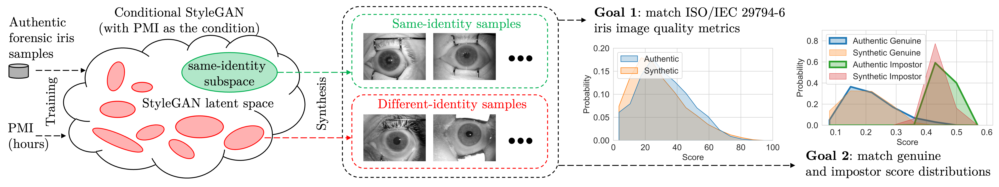

# Forensic Iris Image Synthesis

## IEEE/CVF Winter Conference on Applications of Computer Vision (WACV) 2024 -- Workshop on Manipulation, Adversarial, and Presentation Attacks in Biometrics (MAP-A)

### [Paper](https://openaccess.thecvf.com/content/WACV2024W/MAP-A/papers/Bhuiyan_Forensic_Iris_Image_Synthesis_WACVW_2024_paper.pdf)

## Abstract
Post-mortem iris recognition is an emerging application of iris-based human identification in a forensic setup, able to correctly identify deceased subjects even three weeks post-mortem. This technique thus is considered as an important component of future forensic toolkits. The current advancements in this field are seriously slowed down by exceptionally difficult data collection, which can happen in mortuary conditions, at crime scenes, or in ``body farm'' facilities. This paper makes a novel contribution to facilitate progress in post-mortem iris recognition by offering a conditional StyleGAN-based iris synthesis model, trained on the largest-available dataset of post-mortem iris samples acquired from more than 350 subjects, generating -- through appropriate exploration of StyleGAN latent space -- multiple within-class (same identity) and between-class (different new identities) post-mortem iris images, compliant with ISO/IEC 29794-6, and with decomposition deformations controlled by the requested PMI (post mortem interval). Besides an obvious application to enhance the existing, very sparse, post-mortem iris datasets to advance -- among others -- iris presentation attack endeavors, we anticipate it may be useful to generate samples that would expose professional forensic human examiners to never-seen-before deformations for various PMIs, increasing their training effectiveness. The source codes and model weights are made available with the paper.

<figure>
  
  <figcaption>Figure: Synthesis of PMI-conditioned same- and different-identity forensic iris images, with a desired iris image quality (controlled by matching the ISO quality metrics), and with the desired genuine/impostor score distributions (mimicking score distributions obtained for authentic forensic samples).</figcaption> 

## Obtaining the Dataset
To access the forensic iris synthesis dataset offered with this paper, you can request a copy from the [University of Notre Dame Computer Vision Research Lab](https://cvrl.nd.edu/projects/data). The specific collection related to this work is titled "Synthetic Forensic Iris (UND-SFI-2024) Dataset"

## Obtaining the Trained Model Weights
The trained model weights can be downloaded at [network-snapshot-025000.pkl](https://drive.google.com/drive/folders/16IgnUHyMQpotSMyCyJJJNJTCpt7c2DGe?usp=share_link).

## Contents
- **Training Dataset Preparation:**
  - Code: stylegan2-ada-pytorch-code/dataset_tool.py
  - *Note: To prepare the conditional training dataset, ensure you have a JSON file containing filenames and their corresponding labels. An example JSON file is available in training-dataset/dataset.json.*

- **Training:**
  - Code: stylegan2-ada-pytorch-code/train.py

- **Synthesis Image Generation:**
  - Code: stylegan2-ada-pytorch-code/generate.py
  - *Note: If you want to adjust the noise intensity while generating synthesis images, you can change it by modifying line number 122.*
 
## Create Environment
Set up Python environment using Conda:

``
conda env create -f environment.yml
``

## To Run
1.) Run the following bash script to prepare the training dataset and train the model:

``
./train.sh
``

2.) Run the following bash script to generate synthesis images with different noise intensities:

``
./generate.sh
``

***Note: Make sure you have provided all the valid paths in the script.***

## Citation
Please cite our paper if you use any part of our code or data.
```
@inproceedings{bhuiyan2024forensic,
  title={Forensic Iris Image Synthesis},
  author={Bhuiyan, Rasel Ahmed and Czajka, Adam},
  booktitle={Proceedings of the IEEE/CVF Winter Conference on Applications of Computer Vision},
  pages={1015--1023},
  year={2024}
}
